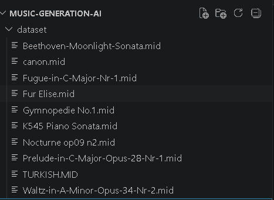
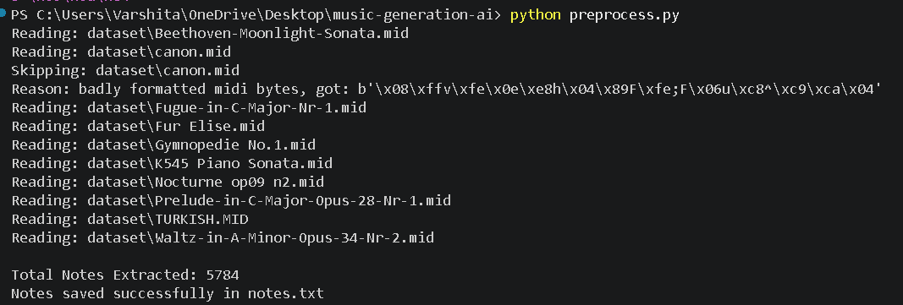
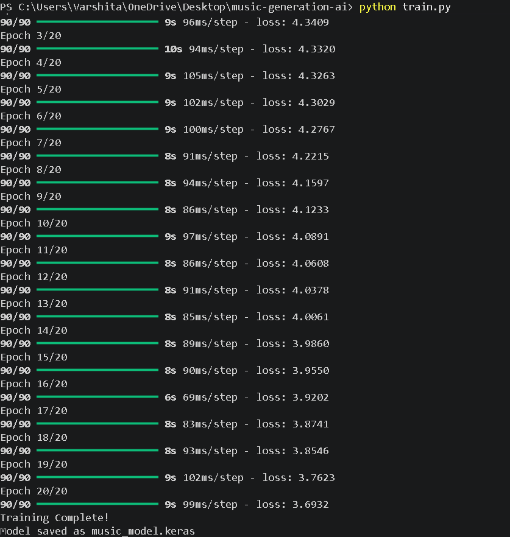
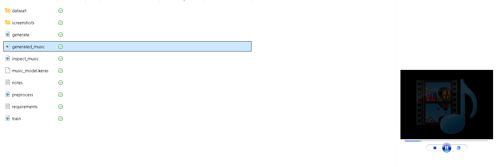

# 🎵 AI Music Generation System

## 📌 Project Overview

This project is an AI-powered Music Generation System developed as part of the CodeAlpha AI Internship.

The system learns musical patterns from MIDI files using Deep Learning (LSTM Neural Networks) and generates new music sequences automatically.

The model is trained on classical piano compositions and creates original note sequences which are converted back into MIDI format for playback.

---

## 🚀 Features

- MIDI music dataset processing
- Music note extraction using Music21
- Deep Learning based music generation
- LSTM Neural Network model
- Automatic sequence prediction
- MIDI file generation
- AI-generated music output
- End-to-end music generation pipeline

---

## 🛠 Technologies Used

- Python
- TensorFlow / Keras
- NumPy
- Music21
- Deep Learning
- LSTM Networks

---

## 🧠 AI Concepts Used

### Natural Language of Music Processing
The MIDI files are converted into note sequences that can be understood by machine learning models.

### LSTM (Long Short-Term Memory)
LSTM networks learn musical patterns and relationships between notes over time.

### Sequence Prediction
The trained model predicts the next musical note based on previously learned patterns.

### Music Generation
Predicted notes are converted into MIDI format to generate entirely new music.

---

## 📂 Project Structure

```
music-generation-ai/
│
├── dataset/
│   ├── Fur Elise.mid
│   ├── Moonlight Sonata.mid
│   ├── Canon.mid
│   ├── Turkish.mid
│   └── Other MIDI files
│
├── screenshots/
│   ├── dataset-files.png
│   ├── preprocessing-output.png
│   ├── model-training.png
│   └── generated-midi-file.png
│
├── preprocess.py
├── train.py
├── generate.py
├── inspect_music.py
├── notes.txt
├── music_model.keras
├── generated_music.mid
├── requirements.txt
└── README.md
```

---

## 🎼 Workflow

### Step 1: Collect MIDI Dataset

Classical MIDI files are collected and stored in the dataset folder.

### Step 2: Preprocess Music Data

Musical notes are extracted from MIDI files and stored as sequences.

```bash
python preprocess.py
```

### Step 3: Train the LSTM Model

The extracted notes are used to train a deep learning model.

```bash
python train.py
```

### Step 4: Generate New Music

The trained model predicts new note sequences and creates a MIDI file.

```bash
python generate.py
```

---

## 📊 Model Training

- Architecture: LSTM Neural Network
- Framework: TensorFlow/Keras
- Input: Musical Note Sequences
- Output: Predicted Next Notes
- Training Epochs: 20

---

## 📸 Screenshots

### Dataset Files



### Preprocessing Output



### Model Training



### Generated MIDI File



---

## 🎯 Results

- Successfully extracted musical notes from MIDI files.
- Trained an LSTM neural network on music sequences.
- Generated new musical note patterns.
- Converted generated notes into a playable MIDI file.

---

## 🔮 Future Improvements

- Larger music datasets
- Genre-specific music generation
- Transformer-based music generation
- Real-time music composition
- Web-based music player interface

---

## 👩‍💻 Author

**Varshita Pallapothu**

CodeAlpha AI Internship Project
